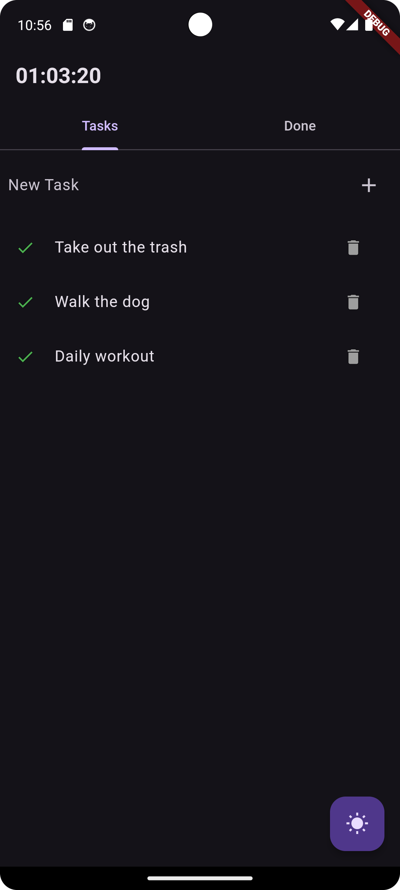
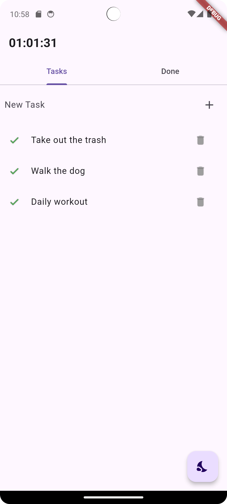

# Daily Tasks App

Daily Tasks is a simple task management app that allows you to track your daily tasks, mark them as done, and reset them at the end of the day. The app also includes features such as dark mode, task reminders, and animations.

## Features

- Add daily tasks
- Mark tasks as done
- Tasks reset at midnight
- Add reminders for tasks
- Dark mode and light mode toggle
- Swipe actions for marking tasks as done
- Animated trashcan icon for deleting tasks

## Getting Started

### Prerequisites

- Flutter SDK: [Install Flutter](https://flutter.dev/docs/get-started/install)
- Android Studio: [Download Android Studio](https://developer.android.com/studio)
- A physical Android device or an emulator

### Installation

1. **Clone the repository**:
    ```sh
    git clone https://github.com/yourusername/daily-tasks-app.git
    cd daily-tasks-app
    ```

2. **Install dependencies**:
    ```sh
    flutter pub get
    ```

3. **Run the app on an emulator or connected device**:
    ```sh
    flutter run
    ```

### Building the APK

To compile the app into an APK for installation on your Android device, follow these steps:

1. **Build the APK**:
    ```sh
    flutter build apk --release
    ```

2. **Locate the APK**:
    The APK will be located in `build/app/outputs/flutter-apk/app-release.apk`.

3. **Install the APK on your device**:
    ```sh
    flutter install
    ```

    Alternatively, you can manually transfer the APK file to your device and install it using a file manager.

## Usage

- **Add Task**: Type your task into the text field and press the add button.
- **Mark Task as Done**: Swipe the task from left to right to mark it as done.
- **Delete Task**: Swipe the task from right to left to delete it.
- **Toggle Dark/Light Mode**: Press the sun/moon icon in the bottom right corner to toggle between dark and light modes.

## Screenshots




## Release Notes

### Version 1.0

- Initial release with the following features:
  - Add daily tasks
  - Mark tasks as done
  - Tasks reset at midnight
  - Add reminders for tasks
  - Dark mode and light mode toggle
  - Swipe actions for marking tasks as done or deleting them
  - Animated trashcan icon for deleting tasks

## Contributing

Contributions are welcome! Please open an issue or submit a pull request.

## License

This project is licensed under the MIT License - see the [LICENSE](LICENSE) file for details.
